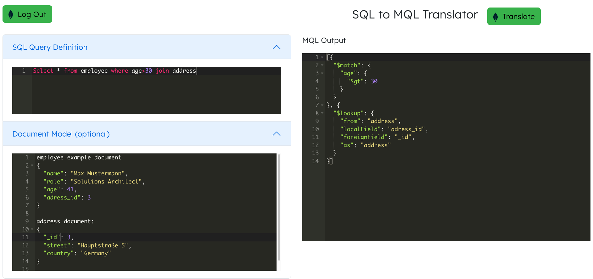

# SQL to MongoDB Query Language translator

This is a private repository and is an example of using ChatGPT to translate SQL statements to MQL.

This repository includes a MongoDB App Service application which runs Functions to call ChatGPT API.
In order to use this repository you will need to have a ChatGPT API key available.



# Setup

Setting up this solution involves a number of steps in the Atlas web portal,
followed by some command line scripts to be run locally.

## Atlas Portal Steps

1. Sign into [MongoDB Atlas](https://cloud.mongodb.com)
2. Create a new Project or select an existing one within your Atlas Organization.
3. Deploy a new cluster in this project to store your ChatGPT interaction.
4. Create an API Key for the project. This will be used to programmatically
   deploy the App Services app:
   _ Click **Access Manager** on the top bar, and then **Project Access**
   _ Click **Create API Key**
   _ Enter an appropriate name for the key, e.g. `SQL2MQL-API`
   _ Select the `Project Owner` role.
   _ Click **Next**
   _ Record the Public and Private Key details and store them securely.
   \_ Add your IP address to the API Access List. \* Click **Done** when you're ready to save the new key to your Project

## Local Command Line Steps

1. Install the following prerequisites on your computer if they aren't already
   present:
   _ [Git](https://git-scm.com/downloads)
   _ [Node.js](https://nodejs.org/en/download/) \* [MongoDB Realm CLI](https://www.mongodb.com/docs/atlas/app-services/cli/)
2. Clone this repo to an appropriate directory on your computer:
   ```
   git clone https://github.com/timolackmann/MQL-Translator.git
   ```
3. Change directory to the cloned project:
   ```
   cd MQL-Translator
   ```
4. Run the setup script
   ```
   ./install.sh
   ```
5. When prompted, enter the public and private API keys for your Organization
   and Project, as well as the name of your cluster. Also, the script will create a first user for the frontend with email/password authentication.
6. Wait for the script to complete and start the frontend application

# Solution Details

The App Services app in this repo contains one function, one trigger and some values & secrets. You
can view and update the deployed app by clicking the **App Services** tab on the top Atlas nav.

### Functions

`ConvertQuery`: uses OpenAI framework to call the ChatGPT API, return the result to the UI and store it to your Atlas cluster

`getConversions`: returns the past queries of the logged in user and utilizes Atlas Search

`cleanup`: function to automatically delete documents from the Atlas cluster older than 30 days

### Values & Secrets

`openai_api_key`: maps to the Private API key for ChatGPT. `Maps to secret_openai_api_key`.

### Triggers

`clean-up-trigger`: runs at 0:00 GMT each Sunday to clean up old Atlas cluster entries using the `cleanup` function above.

# Documentation Links

- [Realm CLI](https://docs.mongodb.com/realm/deploy/realm-cli-reference/)
- [MongoDB Atlas](https://www.mongodb.com/cloud/atlas)
- [Values & Secrets](https://docs.mongodb.com/realm/values-and-secrets/)
- [MongoDB API Resources](https://docs.atlas.mongodb.com/reference/api-resources/)
